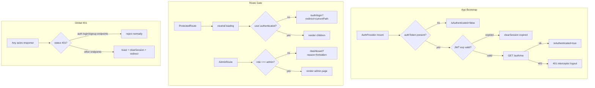

# Auth Routing

Centralized frontend route protection for Teclia Academia. All private screens validate JWT presence and validity before rendering. Expired or missing sessions redirect to login with clear feedback.

## Auth flow



## Route protection table

| Route | Access | Wrapper |
|-------|--------|---------|
| `/` | Public | — |
| `/auth/login` | Public | — |
| `/auth/signup` | Public | — |
| `/auth/forgot-password` | Public | — |
| `/auth/reset-password` | Public | — |
| `/dashboard` | Authenticated | `ProtectedRoute` |
| `/profile` | Authenticated | `ProtectedRoute` |
| `/recursos` | Authenticated | `ProtectedRoute` |
| `/free` | Authenticated | `ProtectedRoute` |
| `/admin` | Admin only | `ProtectedRoute` + `AdminRoute` |
| `/admin/upload` | Admin only | `ProtectedRoute` + `AdminRoute` |
| `/admin/content` | Admin only | `ProtectedRoute` + `AdminRoute` |
| `/admin/students` | Admin only | `ProtectedRoute` + `AdminRoute` |
| `*` (404) | Public | — |

## Query parameters

| Param | Used on | Purpose |
|-------|---------|---------|
| `redirect` | `/auth/login` | Relative path to return to after successful login. Must start with `/` and must not start with `//` (open-redirect guard). |
| `reason=expired` | `/auth/login` | Shows session-expired banner after automatic logout. |
| `reason=forbidden` | `/dashboard` | Shows access-denied banner when a non-admin hits an admin route. |

## Key files

| File | Role |
|------|------|
| `src/context/AuthContext.jsx` | Single source of truth: `user`, `token`, `isAuthenticated`, `login`, `logout`, `clearSession`, `refreshSession` |
| `src/components/auth/ProtectedRoute.jsx` | Auth gate — blocks unauthenticated access |
| `src/components/auth/AdminRoute.jsx` | Role gate — blocks non-admin users |
| `src/routes/index.jsx` | Central route configuration |
| `src/services/api.js` | Axios client with JWT request interceptor and global 401 handler |
| `src/utils/jwt.js` | Client-side JWT `exp` validation |
| `src/utils/authSession.js` | Logout/toast bridge between axios and React (avoids circular imports) |
| `src/utils/safeRedirect.js` | Open-redirect guard for post-login navigation |
| `src/components/common/SessionToast.jsx` | Non-blocking session-expired toast |

## Adding a new protected route

1. Create your page component under `src/pages/`.
2. Register the route in `src/routes/index.jsx`:

```jsx
<Route
  path="/my-page"
  element={
    <ProtectedRoute>
      <MyPage />
    </ProtectedRoute>
  }
/>
```

For admin-only pages, nest `AdminRoute`:

```jsx
<ProtectedRoute>
  <AdminRoute>
    <MyAdminPage />
  </AdminRoute>
</ProtectedRoute>
```

## 401 interceptor behavior

- Runs on every axios response with status `401`.
- **Skipped** for `/auth/login`, `/auth/signup`, `/auth/forgot-password`, `/auth/reset-password` to prevent redirect loops.
- On other endpoints: shows session-expired toast, calls `clearSession`, redirects to `/auth/login?reason=expired`.
- Concurrent 401s are deduplicated via an `isLoggingOut` flag in `authSession.js`.

## Logout behavior

`logout()` and `clearSession()`:

1. Abort in-flight API requests (`AbortController`)
2. Remove `authToken` and `lastLoginEmail` from `localStorage`
3. Reset React auth state
4. Optionally redirect (401 interceptor and manual logout redirect to `/auth/login`)

## Manual test checklist

Use this when validating changes or preparing a PR.

- [ ] Visit `/dashboard` while logged out → redirects to `/auth/login?redirect=%2Fdashboard` with no content flash
- [ ] Log in from that redirect → lands on `/dashboard`
- [ ] Set `?redirect=https://evil.com` on login → after login, lands on `/dashboard` (not external URL)
- [ ] Put an expired JWT in `localStorage` → redirect to `/auth/login?reason=expired` with banner
- [ ] With a valid session, replace token with invalid value → next API call shows toast and redirects with expired banner
- [ ] Wrong credentials on login → stays on login page, no redirect loop
- [ ] Log in as student → visit `/admin` → redirect to `/dashboard?reason=forbidden` with banner
- [ ] Profile save → submit disabled while saving, success message on completion
- [ ] Profile save with API error → error banner or field error, page does not crash
- [ ] Logout from Navbar → token cleared, lands on `/auth/login`
