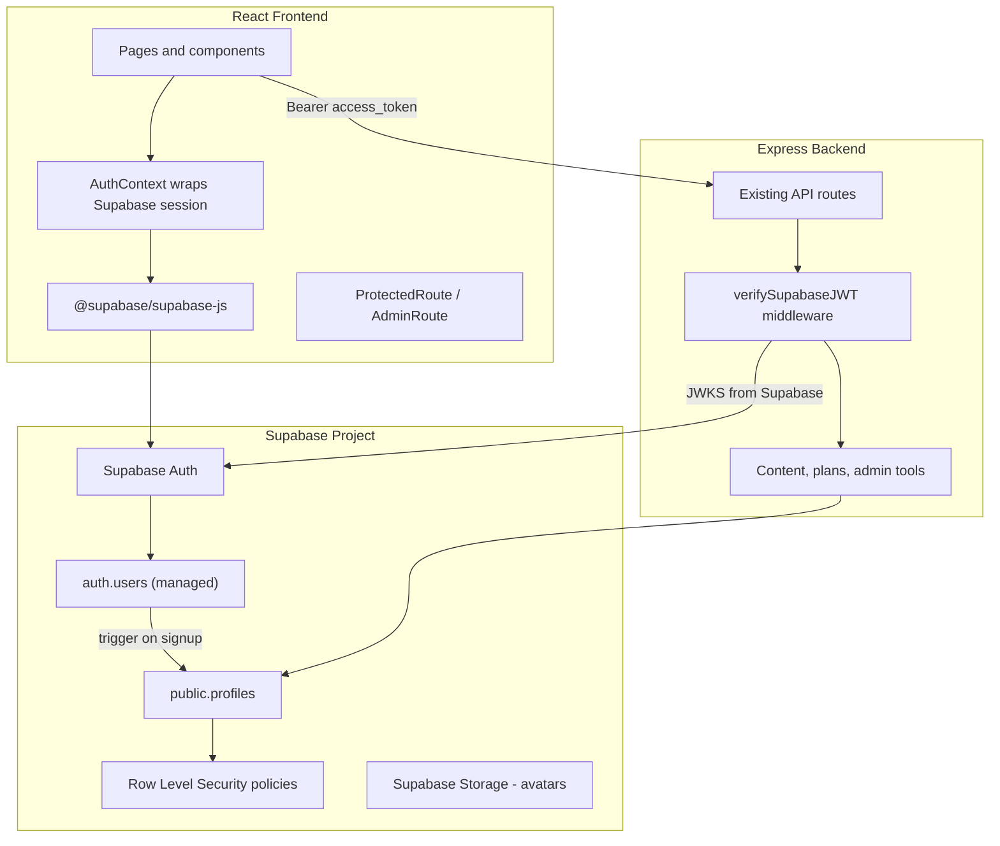

# Supabase Auth Migration Proposal

**Project:** Teclia Academia  
**Status:** Proposal (not implemented)  
**Audience:** Frontend, backend, and DevOps contributors  
**Last updated:** June 2026

---

## Executive summary

Teclia Academia currently runs a **custom JWT auth stack**: the Express backend issues 24-hour tokens signed with `JWT_SECRET`, stores password hashes in a local `users` table, and sends password-reset PINs via SendGrid. The React frontend stores tokens in `localStorage`, validates expiry client-side, and protects routes through `ProtectedRoute` / `AdminRoute`.

This works for a small MVP, but it places the burden of security-sensitive features—session refresh, OAuth, email verification, rate limiting, and breach-resistant token storage—entirely on the team.

**Recommendation:** migrate authentication to **Supabase Auth** while keeping application data (content, plans, admin tools) in the existing backend or Supabase Postgres. Supabase becomes the identity provider; the backend validates Supabase-issued JWTs instead of self-signed tokens.

This document describes a **robust, phased migration path** supporting:

- Email + password
- Magic link (passwordless email)
- Social providers (Google, Apple, GitHub — extensible)
- Automatic token refresh
- Built-in password reset and email verification
- Role-based access (`admin`, `student`, `premium`) via a `profiles` table and RLS

---

## Current state (baseline)

| Layer | Implementation today | Limitations |
|-------|---------------------|-------------|
| **Frontend** | `AuthContext`, `localStorage.authToken`, client JWT `exp` check, axios 401 interceptor | XSS exposure from `localStorage`; no refresh tokens; manual session UX |
| **Backend** | `jsonwebtoken` + `bcryptjs`, custom `/auth/*` routes | Team maintains auth endpoints, PIN reset flow, email delivery |
| **User model** | SQLite/Postgres `users` table: `id`, `email`, `password_hash`, `role`, `plan_tier`, `avatar_url` | Integer IDs; passwords stored alongside app data |
| **Roles** | `admin`, `student`, `premium` enforced in middleware + frontend guards | Role lives in custom JWT payload, not a standard claims model |
| **Password recovery** | 6-digit PIN + SendGrid email, 15-minute expiry | Custom flow; no email verification on signup |
| **Storage** | Supabase storage provider already exists (`Backend/storage/supabaseProvider.js`) | Auth not yet integrated with Supabase |

The recent route-protection work ([auth-routing.md](./auth-routing.md)) improves the **client boundary** but does not fix the underlying identity architecture.

---

## Why Supabase Auth

Supabase Auth is a managed authentication service built on [GoTrue](https://github.com/supabase/gotrue), integrated with Supabase Postgres and Row Level Security (RLS).

### Advantages

| Benefit | Impact for Teclia Academia |
|---------|---------------------------|
| **Managed identity** | No more maintaining signup/login/reset endpoints, bcrypt rounds, or PIN logic |
| **Automatic refresh** | Short-lived access tokens + refresh tokens handled by the SDK; eliminates most “session expired” UX issues |
| **OAuth out of the box** | Google, Apple, GitHub, Discord, etc. with minimal config |
| **Email verification & reset** | Built-in templates, link-based reset (more secure than PIN-in-email) |
| **PKCE + secure defaults** | Industry-standard OAuth2/OIDC flows without custom implementation |
| **JWT verification via JWKS** | Backend validates tokens with public keys — no shared `JWT_SECRET` for user sessions |
| **Row Level Security** | Enforce `student` vs `admin` data access at the database layer |
| **Audit & analytics** | Auth events visible in Supabase dashboard |
| **Aligns with existing stack** | Project already uses Supabase storage; auth + DB can live in the same project |
| **Free tier** | 50,000 MAU on free plan — sufficient for early growth |

### Trade-offs and risks

| Concern | Mitigation |
|---------|------------|
| **Vendor dependency** | Supabase is open-source; self-host GoTrue if needed |
| **Migration complexity** | Phased rollout; dual-auth period; user account linking |
| **Integer `users.id` → UUID** | Map `auth.users.id` (UUID) to `profiles` table; migrate FKs |
| **Existing password users** | One-time migration script or forced password reset |
| **Custom admin bootstrap** | Seed admin via Supabase dashboard or migration SQL |
| **Backend still needed** | Content uploads, plan management, and business logic remain in Express |

---

## Target architecture



### Design principles

1. **Supabase owns identity** — passwords, OAuth, sessions, email flows.
2. **`profiles` owns app identity** — `name`, `role`, `plan_tier`, `avatar_url`, linked by `id = auth.users.id`.
3. **Backend validates Supabase JWTs** — replace `JWT_SECRET` verification with Supabase JWKS.
4. **Frontend uses Supabase session** — remove `localStorage.authToken`; use `@supabase/supabase-js` session (memory + secure persistence options).
5. **Keep route guards** — `ProtectedRoute` / `AdminRoute` read from Supabase session + `profiles`, not custom JWT decode.

---

## Recommended auth methods

Enable progressively; all can coexist.

| Method | Priority | Use case |
|--------|----------|----------|
| **Email + password** | P0 | Default for students; replaces current signup/login |
| **Magic link** | P1 | Lower friction signup; good for mobile |
| **Google OAuth** | P0 | Most common social login for education platforms |
| **Apple Sign In** | P1 | Required for iOS App Store if native app is added later |
| **GitHub OAuth** | P2 | Optional for developer/instructor audience |
| **Email verification** | P0 | Confirm email before full access (configurable) |
| **Password reset (link)** | P0 | Replace PIN-based SendGrid flow |

### Suggested Supabase Auth settings

```text
Site URL:          https://teclia-academia.com (or Vercel preview URL for staging)
Redirect URLs:     http://localhost:5173/auth/callback
                   https://<production-domain>/auth/callback

JWT expiry:        3600 (1 hour access token — refresh handles continuity)
Refresh token:     enabled, rotation enabled
Email confirmations: enabled for production
Secure email change: enabled
```

---

## Data model

### New `profiles` table (public schema)

Supabase Auth stores users in `auth.users`. Application fields move to `profiles`:

```sql
create table public.profiles (
  id uuid primary key references auth.users(id) on delete cascade,
  email text not null,
  name text not null,
  role text not null default 'student'
    check (role in ('admin', 'student', 'premium')),
  plan_tier text check (plan_tier in ('basico', 'pro', 'master')),
  avatar_url text,
  created_at timestamptz default now(),
  updated_at timestamptz default now()
);

-- Auto-create profile on signup
create or replace function public.handle_new_user()
returns trigger as $$
begin
  insert into public.profiles (id, email, name, role)
  values (
    new.id,
    new.email,
    coalesce(new.raw_user_meta_data->>'name', split_part(new.email, '@', 1)),
    coalesce(new.raw_user_meta_data->>'role', 'student')
  );
  return new;
end;
$$ language plpgsql security definer;

create trigger on_auth_user_created
  after insert on auth.users
  for each row execute function public.handle_new_user();
```

### Role and plan enforcement

| Concern | Where to enforce |
|---------|------------------|
| **Route access (UI)** | `ProtectedRoute`, `AdminRoute` — read `profiles.role` |
| **API authorization** | Express middleware reads JWT + fetches/caches profile |
| **Direct DB access** | RLS policies on `profiles`, `content`, etc. |
| **Admin actions** | `adminOnly` middleware + RLS `role = 'admin'` |

Example RLS policy:

```sql
alter table public.profiles enable row level security;

create policy "Users can read own profile"
  on public.profiles for select
  using (auth.uid() = id);

create policy "Admins can read all profiles"
  on public.profiles for select
  using (
    exists (
      select 1 from public.profiles
      where id = auth.uid() and role = 'admin'
    )
  );
```

### ID migration strategy

Current `users.id` is an **integer**. Supabase Auth uses **UUIDs**.

**Recommended approach:** create a new `profiles` table keyed by UUID; maintain a temporary `legacy_user_map (old_id, new_uuid)` during migration; update `content.uploaded_by` and other FKs in a controlled migration window.

Alternative (greenfield): if user count is very low, export users, recreate accounts, and notify users to reset passwords via Supabase.

---

## Backend integration

Replace custom JWT verification in [`Backend/middleware/auth.js`](../Backend/middleware/auth.js):

```javascript
import { createClient } from '@supabase/supabase-js';
import jwt from 'jsonwebtoken';
import jwksClient from 'jwks-rsa';

// Verify Supabase access token via JWKS
export const verifySupabaseToken = async (req, res, next) => {
  const token = req.headers.authorization?.split(' ')[1];
  if (!token) return res.status(401).json({ error: 'No token provided' });

  try {
    const decoded = await verifyWithSupabaseJwks(token);
    req.user = { id: decoded.sub, email: decoded.email };
    // Optionally attach profile role from DB cache
    next();
  } catch {
    return res.status(401).json({ error: 'Invalid or expired token' });
  }
};
```

Or use the official helper:

```javascript
const supabase = createClient(SUPABASE_URL, SUPABASE_SERVICE_ROLE_KEY);
const { data: { user }, error } = await supabase.auth.getUser(token);
```

### Endpoints to deprecate

| Current endpoint | Replacement |
|------------------|---------------|
| `POST /auth/signup` | Supabase `signUp()` |
| `POST /auth/login` | Supabase `signInWithPassword()` |
| `POST /auth/logout` | Supabase `signOut()` |
| `POST /auth/forgot-password` | Supabase `resetPasswordForEmail()` |
| `POST /auth/reset-password` | Supabase callback + `updateUser()` |
| `GET /auth/me` | Supabase session + `profiles` select |
| `POST /auth/change-password` | Supabase `updateUser({ password })` |

### Endpoints to keep (modified)

| Endpoint | Change |
|----------|--------|
| `PATCH /auth/profile` | Update `profiles` table; avatar upload to Supabase Storage |
| `GET /auth/students` | Admin-only; query `profiles` where `role != 'admin'` |
| `PATCH /auth/students/:id/plan` | Admin-only; update `plan_tier` + `role` |
| `DELETE /auth/students/:id` | Admin-only; delete via Supabase Admin API + cascade |

---

## Frontend integration

Replace the custom token layer with `@supabase/supabase-js`.

### New dependencies

```bash
npm install @supabase/supabase-js
```

### Client setup

```javascript
// src/lib/supabase.js
import { createClient } from '@supabase/supabase-js';

export const supabase = createClient(
  import.meta.env.VITE_SUPABASE_URL,
  import.meta.env.VITE_SUPABASE_ANON_KEY,
  {
    auth: {
      autoRefreshToken: true,
      persistSession: true,
      detectSessionInUrl: true,
    },
  }
);
```

### AuthContext refactor (high level)

```javascript
// On mount: supabase.auth.getSession()
// Subscribe: supabase.auth.onAuthStateChange()
// Login: supabase.auth.signInWithPassword({ email, password })
// OAuth: supabase.auth.signInWithOAuth({ provider: 'google' })
// Logout: supabase.auth.signOut()
// Profile: fetch from profiles table or embed in user metadata
```

### Route protection changes

Keep [`ProtectedRoute`](../src/components/auth/ProtectedRoute.jsx) and [`AdminRoute`](../src/components/auth/AdminRoute.jsx), but:

- Remove `localStorage.authToken` and [`src/utils/jwt.js`](../src/utils/jwt.js) client expiry checks
- Remove axios manual Bearer injection; use Supabase `access_token` or `supabase.auth.getSession()` per request
- Session refresh is automatic — simplify 401 interceptor to `signOut()` + redirect only on hard failures
- OAuth callback route: add `/auth/callback` to exchange code for session

### OAuth UI additions

Login page should offer:

```text
[ Continue with Google ]
[ Continue with Apple  ]  (optional P1)
──────── or ────────
Email + password form (existing layout)
[ Send magic link     ]  (optional P1)
```

Use Supabase provider icons and existing Teclia auth page styling.

---

## Migration phases

### Phase 0 — Preparation (1–2 days)

- [ ] Create Supabase project (or use existing one with storage)
- [ ] Enable Auth providers in dashboard (email, Google)
- [ ] Define `profiles` schema + RLS policies in SQL migration
- [ ] Add env vars: `VITE_SUPABASE_URL`, `VITE_SUPABASE_ANON_KEY`, `SUPABASE_SERVICE_ROLE_KEY`
- [ ] Document redirect URLs for local, staging, production

### Phase 1 — Parallel infrastructure (3–5 days)

- [ ] Add `@supabase/supabase-js` to frontend
- [ ] Implement new `AuthProvider` backed by Supabase (feature flag: `VITE_AUTH_PROVIDER=supabase`)
- [ ] Implement `verifySupabaseToken` middleware (feature flag on backend)
- [ ] Add `/auth/callback` route for OAuth/magic links
- [ ] Create `profiles` trigger for new signups
- [ ] Do **not** remove legacy auth yet

### Phase 2 — User migration (2–4 days)

- [ ] Export existing users from SQLite/Postgres
- [ ] For each user: create Supabase Auth account via Admin API (`auth.admin.createUser`) with temporary password OR send invite
- [ ] Populate `profiles` with `role`, `plan_tier`, `avatar_url`
- [ ] Build `legacy_user_map` for content FK updates
- [ ] Migrate `content.uploaded_by` to UUID FKs
- [ ] Verify admin account works end-to-end

### Phase 3 — Cutover (1–2 days)

- [ ] Enable Supabase auth in production via feature flag
- [ ] Deprecate `POST /auth/login`, `/signup`, PIN reset endpoints
- [ ] Remove `JWT_SECRET` session signing for users (keep only if needed for service-to-service)
- [ ] Remove `localStorage.authToken`, `src/utils/jwt.js`, SendGrid PIN reset code
- [ ] Update [auth-routing.md](./auth-routing.md) to reflect Supabase session model
- [ ] Monitor Supabase Auth logs for failed logins / OAuth errors

### Phase 4 — Hardening (ongoing)

- [ ] Enable MFA for admin accounts (Supabase TOTP)
- [ ] Add rate-limit alerts
- [ ] Set up custom SMTP (optional) for branded emails
- [ ] Add Apple/GitHub providers if needed
- [ ] Security review of RLS policies

---

## Environment variables

### Frontend (`.env`)

```bash
VITE_SUPABASE_URL=https://<project-ref>.supabase.co
VITE_SUPABASE_ANON_KEY=<anon-key>
VITE_AUTH_PROVIDER=supabase   # legacy | supabase during migration
```

### Backend (`Backend/.env`)

```bash
SUPABASE_URL=https://<project-ref>.supabase.co
SUPABASE_ANON_KEY=<anon-key>
SUPABASE_SERVICE_ROLE_KEY=<service-role-key>  # server only, never expose to client
SUPABASE_JWT_SECRET=<jwt-secret-from-dashboard>  # optional if using manual verify
```

---

## Security considerations

| Topic | Recommendation |
|-------|----------------|
| **Token storage** | Prefer Supabase SDK session management over manual `localStorage` JWT |
| **Service role key** | Backend only; never in frontend bundle |
| **RLS** | Enable on all public tables; test with anon vs authenticated vs admin JWTs |
| **OAuth redirect URLs** | Strict allowlist; no wildcards in production |
| **Email verification** | Require before accessing `/recursos` or paid content |
| **Admin accounts** | MFA recommended; create via dashboard, not public signup |
| **CORS** | Restrict Supabase and API origins per environment |
| **Audit** | Log admin actions (plan changes, student deletion) in backend |

---

## Testing strategy

| Area | Tests |
|------|-------|
| **Unit** | `profiles` trigger creates row on signup; role defaults to `student` |
| **Integration** | Email signup → email confirm → login → `/auth/me` equivalent |
| **OAuth** | Google login on staging; callback lands on intended `redirect` path |
| **Backend** | Express routes reject expired/invalid Supabase JWT; accept valid |
| **RLS** | Student cannot read other profiles; admin can list students |
| **Migration** | Legacy user logs in with migrated credentials; content FK intact |
| **Regression** | All routes in [auth-routing.md](./auth-routing.md) protection table |
| **Security** | Open redirect guard still works; service role not leaked |

---

## Rollback plan

During Phase 1–2, keep legacy auth behind `VITE_AUTH_PROVIDER=legacy`.

If Supabase cutover fails:

1. Flip feature flag back to `legacy`
2. Legacy `users` table and JWT flow remain untouched until Phase 3 deletion
3. New Supabase-only users may need manual support — avoid deleting legacy table until stable for 2+ weeks

---

## Cost estimate

| Tier | MAU | Approx. cost |
|------|-----|--------------|
| Free | ≤ 50,000 | $0 |
| Pro | > 50,000 | ~$25/mo base + usage |

OAuth, email sends, and MFA are included within reasonable limits on the free tier. Custom SMTP (SendGrid/Resend) may still be used for transactional non-auth emails.

---

## What gets removed after migration

| Component | Action |
|-----------|--------|
| `Backend/controllers/authController.js` (signup/login/PIN reset) | Remove or archive |
| `JWT_SECRET` user session signing | Remove |
| `localStorage.authToken` | Remove |
| `src/utils/jwt.js` | Remove |
| SendGrid PIN reset emails | Remove |
| `password_hash`, `reset_pin` columns | Drop after migration verified |
| axios 401 → manual JWT logout | Simplify to Supabase `signOut()` |

**Keep:** `ProtectedRoute`, `AdminRoute`, route config pattern, profile update UI, admin student management (rewired to `profiles`).

---

## Recommended provider priority for Teclia Academia

```text
Phase 1 (launch)
  ✓ Email + password
  ✓ Google OAuth
  ✓ Email verification
  ✓ Link-based password reset

Phase 2 (polish)
  ○ Magic link
  ○ Apple Sign In
  ○ Custom email templates (brand)

Phase 3 (optional)
  ○ GitHub OAuth
  ○ MFA for admins
  ○ Phone OTP (if LATAM SMS needed)
```

---

## Success criteria

Migration is complete when:

- [ ] New users can sign up with email or Google without touching legacy endpoints
- [ ] Sessions refresh automatically with no manual `exp` checks in the frontend
- [ ] All protected routes work with Supabase session (see [auth-routing.md](./auth-routing.md))
- [ ] Admin/student/plan roles enforced via `profiles.role` + RLS
- [ ] Legacy PIN password reset is fully replaced
- [ ] Existing migrated users can log in and see their content
- [ ] No auth tokens stored in `localStorage` manually
- [ ] Backend validates Supabase JWTs only (no shared symmetric secret for user sessions)

---

## References

- [Supabase Auth documentation](https://supabase.com/docs/guides/auth)
- [Supabase JS client](https://supabase.com/docs/reference/javascript/auth-api)
- [Verifying JWTs in your backend](https://supabase.com/docs/guides/auth/server-side/verifying-jwts)
- [Row Level Security](https://supabase.com/docs/guides/database/postgres/row-level-security)
- [Social login (OAuth)](https://supabase.com/docs/guides/auth/social-login)
- Teclia current route protection: [auth-routing.md](./auth-routing.md)
- Teclia developer setup: [DEVELOPER_SETUP.md](../DEVELOPER_SETUP.md)

---

## Next steps

1. Review and approve this proposal with the team
2. Create a Supabase project and run the `profiles` SQL migration in staging
3. Open a tracking issue/epic: **“Migrate to Supabase Auth”** with Phase 0–4 checklist
4. Implement Phase 1 behind a feature flag without breaking current contributors’ local setup
